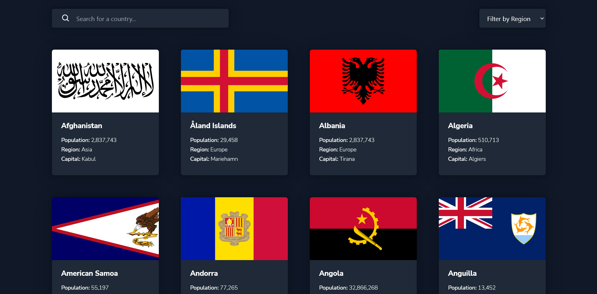
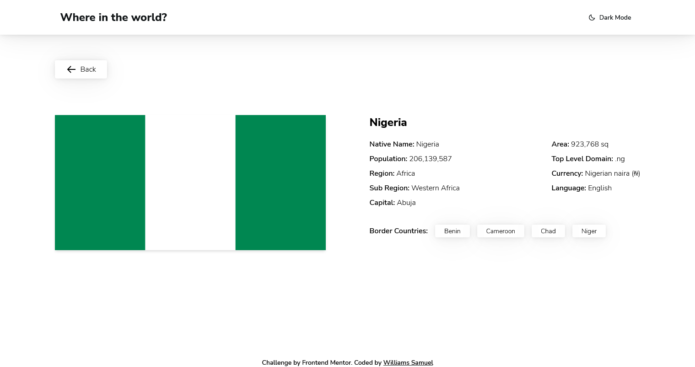

# REST Countries API with color theme switcher solution - Frontend Mentor

## Overview

- Install pnpm as your package manager using <code>npm install -g pnpm</code> or delete the 'pnpm-lock.yaml' file and install dependencies with either yarn or npm.
- Install depedencies using, <code>pnpm install</code>. If you are not using 'pnpm', after (1) above, install dependecies using <code>yarn</code> or <code>npm install</code> depending on your package manager
- then run, <code>pnpm dev</code> or <code>yarn dev</code> or <code>npm run dev</code> to start the server at <code>localhost:3000</code>

### Screenshot

### Links

- Solution URL: [Add solution URL here](https://your-solution-url.com)
- Live Site URL: [Add live site URL here](https://your-live-site-url.com)

### Built with

- [Svelte Kit](https://kit.svelte.dev) - JS library
- Tailwind CSS - for styling

### What I learned

- Learnt how to use svelte and svelte kit
- Learnt how to bootstrap sveltekit project with tailwindcss using [https://jsco.dev/blog/how-to-set-up-tailwindcss-with-svelte-kit](https://jsco.dev/blog/how-to-set-up-tailwindcss-with-svelte-kit)

### Useful resources

- [Sveltekit Docs](https://kit.svelte.dev/docs)

## Author

- Website - [Williams Samuel](https://williamssam.netlify.app/)
- Twitter - [@williams_codes](https://www.twitter.com/williams_codes)

## Acknowledgments

Watched James Quick [SvelteKit crash course](https://www.youtube.com/watch?v=UU7MgYIbtAk&t=32s)
